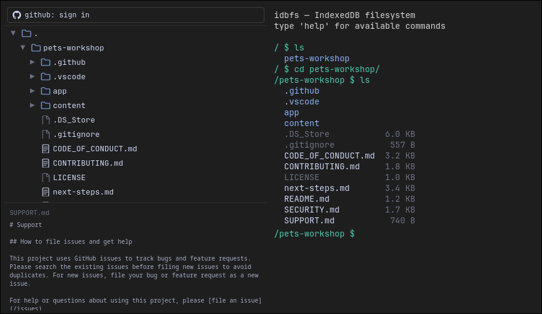

# idbfs

A browser filesystem backed by IndexedDB. Licensed under MIT.



---

## Installation

```sh
npm install @octalgia/idbfs
```

```ts
import { connectIdbfs, FileTree, Terminal } from "@octalgia/idbfs";
import "@octalgia/idbfs/style.css"; // required for the React components
```

To run this repo's demo app locally:

```sh
git clone https://github.com/matsondawson/idbfs.git
pnpm install
pnpm run dev
```

---

## API

All exports come from the package root (in this repo, `src/lib`):

```ts
import {
  connectIdbfs,
  Idbfs,
  complete,
  buildIgnoreMatcher,
  mimeFromName,
  ROOT_ID,
  FileTree,
  Terminal,
  runCommand,
  fileIconColor,
} from "@octalgia/idbfs";
import type {
  Entry,
  FileEntry,
  DirEntry,
  ListEntry,
  EntryType,
  IdbfsOptions,
  DirStats,
  FsEvent,
  FsEventType,
  CompletionResult,
  IgnoreMatcher,
  Feature,
  Segment,
  OutputLine,
  CommandResult,
  ExtraCommand,
} from "@octalgia/idbfs";
```

---

### `connectIdbfs(options?)`

```ts
const fs = await connectIdbfs({ dbName: "myapp" });
```

| Option      | Type      | Default   |
| ----------- | --------- | --------- |
| `dbName`    | `string`  | `'idbfs'` |
| `dbVersion` | `number`  | `3`       |
| `readOnly`  | `boolean` | `false`   |

`fs.readOnly` exposes the flag back. When `true`, every mutating method (`writeFile`, `mkdir`, `rm`, `rmdir`, `mv`, `cp`, `renameNode`, `mkdirUnder`, `rmById`, `rmDirById`, `mvNode`, `cpNode`) throws `Error("filesystem is read-only")` instead of touching the DB; read methods (`ls`, `readFile`, `stat`, `exists`, `du`, `lsById`, `downloadFile`, `downloadDir`) are unaffected. `FileTree` reads this flag itself and hides every mutating control (New folder, Paste, Rename, Delete, drag-to-move, OS drag/paste upload) when the `fs` it's given is read-only.

`connectIdbfs()`/`new Idbfs().init()` rejects instead of hanging if the browser won't cooperate: no `IndexedDB` global at all (private browsing, disabled site data, an unsupported browser) rejects immediately with a descriptive error, and an open request left pending because another tab holds an older DB version open (`indexedDB`'s `blocked` event) rejects rather than waiting forever for that tab to close. Always `.catch()` `connectIdbfs()` — the demo (`src/App.tsx`) shows this state instead of sitting on "initializing…" indefinitely.

---

### Path-based API

All path methods accept an optional `cwd` (default `'/'`) for resolving relative paths. Paths support `.` and `..`.

#### `fs.writeFile(path, data, cwd?)`

Write a file. Creates parent directories as needed. Overwrites if the file exists.

```ts
await fs.writeFile("/docs/hello.txt", "hello world");
await fs.writeFile("/img/photo.png", arrayBuffer);
await fs.writeFile("notes.txt", "hi", "/docs");
```

#### `fs.readFile(path, cwd?)` → `FileEntry`

```ts
const file = await fs.readFile("/docs/hello.txt");
const text = new TextDecoder().decode(file.data);
```

`FileEntry`: `{ id, name, parentId, path, type:'file', data:ArrayBuffer, size, createdAt, modifiedAt }`

#### `fs.ls(path?, cwd?)` → `ListEntry[]`

Sorted directories-first then alphabetically.

```ts
const entries = await fs.ls("/docs");
```

`ListEntry`: `{ id, name, path, type, size, modifiedAt }`

#### `fs.mkdir(path, cwd?)`

Creates intermediate directories as needed. No-op if already exists.

#### `fs.rm(path, cwd?)`

Remove a file. Throws if it is a directory.

#### `fs.rmdir(path, cwd?)`

Remove an empty directory. Throws if it has contents.

#### `fs.mv(src, dest, cwd?)`

Move or rename a file or directory. If `dest` is an existing directory, source moves into it. Creates parent dirs of `dest` as needed. If `dest` resolves to an existing **file**, it is silently overwritten (unlike `cp`, which errors). Moving a directory is O(1) — only its node is updated.

```ts
await fs.mv("draft.txt", "final.txt");
await fs.mv("photo.png", "/archive"); // → /archive/photo.png
await fs.mv("/old-dir", "/new-dir");
```

#### `fs.cp(src, dest, cwd?)`

Copy a file or directory recursively. Errors if destination already exists or would be inside src.

#### `fs.stat(path, cwd?)` → `Omit<Entry, 'data'>`

Metadata without file data.

#### `fs.exists(path, cwd?)` → `boolean`

#### `fs.resolve(path, cwd?)` → `string`

Normalise a path string without touching the DB.

#### `fs.listen(path, callback)` → `() => void`

Watch a directory for filesystem events. Returns an unsubscribe function.

```ts
const unlisten = fs.listen("/uploads", (event: FsEvent) => {
  console.log(event.type, event.path, event.oldPath);
});

await fs.writeFile("/uploads/photo.jpg", buf);
// → { type: 'write', path: '/uploads/photo.jpg' }

await fs.mv("/uploads/photo.jpg", "/archive/");
// → { type: 'move', path: '/archive/photo.jpg', oldPath: '/uploads/photo.jpg' }

unlisten(); // stop watching
```

`FsEvent`: `{ type: FsEventType, path: string, oldPath?: string }`

| `FsEventType` | Trigger                                                                              |
| ------------- | ------------------------------------------------------------------------------------ |
| `write`       | `writeFile` — file created or overwritten                                            |
| `delete`      | `rm`, `rmById` — file deleted                                                        |
| `mkdir`       | `mkdir`, `mkdirUnder` — directory created (one event per new segment)                |
| `rmdir`       | `rmdir`, `rmDirById` — directory deleted                                             |
| `move`        | `mv`, `mvNode`, `renameNode` — node moved or renamed; `oldPath` is the previous path |
| `copy`        | `cp`, `cpNode` — node copied; `oldPath` is the source path                           |

Listening on `'/'` receives all events. Listeners match the watched path itself and any path beneath it. Listener errors are caught and isolated.

---

#### `fs.downloadFile(path, cwd?)`

Trigger a browser download for a single file.

```ts
await fs.downloadFile("/docs/hello.txt");
```

#### `fs.downloadDir(path?, cwd?)`

Trigger a browser download for every file in a directory (recursively). One download per file — no zip. Browsers may prompt to allow multiple downloads for the site.

```ts
await fs.downloadDir("/uploads");
await fs.downloadDir(); // entire filesystem
```

---

#### `fs.du(path?, cwd?)` → `DirStats`

Recursive file count and size.

```ts
const { files, size, dirs } = await fs.du("/docs");
```

`DirStats`: `{ path, files, size, dirs: DirStats[] }`

---

### Node-ID-based API

Use these when you already have a node ID (e.g. from the file tree). No path resolution overhead.

| Method                                     | Description                            |
| ------------------------------------------ | -------------------------------------- |
| `fs.lsById(nodeId)`                        | List children of a directory node      |
| `fs.renameNode(nodeId, newName)`           | Rename a node in place                 |
| `fs.mkdirUnder(parentId, name)`            | Create a directory under a parent node |
| `fs.rmById(nodeId)`                        | Delete a file node                     |
| `fs.rmDirById(nodeId)`                     | Delete an empty directory node         |
| `fs.mvNode(srcId, destParentId, newName?)` | Move a node to a new parent            |
| `fs.cpNode(srcId, destParentId, newName?)` | Copy a node to a new parent            |

`ROOT_ID` is the fixed string ID of the root node (`"root"`).

---

### `complete(input, cwd, fs)` → `CompletionResult`

Tab completion for terminal UIs. Completes command names on the first token, filesystem entries on subsequent tokens and on paths starting with `/`, `./`, or `..`.

```ts
const result = await complete("ls doc", "/", fs);
result.value; // 'ls docs/'  — replacement string (null if ambiguous)
result.candidates; // ['docs']    — all matches
```

---

### `buildIgnoreMatcher(fs, rootPath)` → `Promise<IgnoreMatcher>`

Async — builds a single predicate `IgnoreMatcher = (relPath, isDir) => boolean` from every `.gitignore` found under `rootPath`, cascaded per real git semantics (deeper rules layer on top of shallower ones, including negations). `relPath` is relative to `rootPath`. Used internally by `FileTree`'s "Show gitignored files" filter.

```ts
const isIgnored = await buildIgnoreMatcher(fs, "/");
isIgnored("node_modules", true); // true if a .gitignore says so
```

---

### `mimeFromName(name)` → `string`

MIME type from a filename's extension (e.g. `'photo.png'` → `'image/png'`). Known dotfiles (`.gitignore`, `.env`, …) map to `'text/plain'`; anything unrecognised falls back to `'application/octet-stream'`. Used by `view`, previews, and uploads.

### `fileIconColor(name, type)` → `{ path, color }`

SVG path data (16×16 viewBox) and hex color for a file or directory icon, keyed off extension. What `FileTree` and the terminal's `ls` use for their icons.

---

## React components

### `FileTree`

```tsx
import { FileTree } from "@octalgia/idbfs";

<FileTree fs={fs} refreshKey={n} cwd={cwd} onUploaded={(names) => console.log(names)} />;
```

- Expand/collapse directories via the `▶`/`▼` chevron
- Click a file to preview (image, audio, or text) in the panel below the tree
- Double-click any node to rename inline
- Right-click for context menu: New folder (dirs), Paste (dirs, when the clipboard has entries), Copy, Rename, Download (when files are selected), Delete
- Keyboard (when the tree has focus): Ctrl/Cmd+C copies selected nodes, Ctrl/Cmd+V pastes (copied nodes, clipboard text as a new file, or a clipboard image), Delete deletes the selection. Shift-click and Ctrl/Cmd-click extend the selection.
- Drag a node onto a directory to move it
- Drag files from the OS onto the tree, or paste an image, to upload into `cwd` — reported via `onUploaded`
- `Filter ▾` menu — toggle "Show hidden files" (dotfiles, off by default) and "Show gitignored files" (off by default, matched against every `.gitignore` found under `/`). Sits in a top bar with `toolbar`, to `toolbar`'s left.
- If `fs.readOnly` is `true`, every mutating control above (New folder, Paste, Rename, Delete, drag-to-move, OS drag/paste upload) is hidden — browsing, Copy, and Download still work
- `refreshKey` — increment after any filesystem mutation to reload expanded directories
- `theme?: 'light' | 'dark'` — colour scheme, default `'dark'`
- `features?: Feature[]` — currently `Feature = "github"`; defaults to `["github"]`. Drop `"github"` from the array to hide `toolbar` and `renderContextMenuExtra` regardless of what's passed in — a runtime kill switch for the GitHub-sync UI hooks below, for consumers that wire up sync but want to toggle it off without unmounting
- `toolbar` — optional `ReactNode` rendered next to the `Filter ▾` button (only shown when `features` includes `"github"`)
- `renderContextMenuExtra(entry, close)` — inject extra context-menu items (used by GitHub sync's per-folder actions; only invoked when `features` includes `"github"`)

OS file drop and clipboard image paste are built in — both `FileTree` and `Terminal` accept an `onUploaded?: (names: string[]) => void` prop and handle drag/paste internally.

---

### `Terminal`

A controlled component: it renders output blocks and an input line, but owns no command state — you keep `lines`/`history` in your app, run each submitted command through `runCommand`, and append the result. `src/App.tsx` is the reference wiring.

```tsx
import { Terminal, runCommand } from "@octalgia/idbfs";
import type { OutputLine } from "@octalgia/idbfs";

const [lines, setLines] = useState<Array<{ prompt?: string; output: OutputLine[] }>>([]);
const [history, setHistory] = useState<string[]>([]);
const [cwd, setCwd] = useState("/");

async function handleSubmit(cmd: string) {
  setHistory((h) => [...h, cmd]);
  const result = await runCommand(cmd, cwd, fs);
  setLines((prev) => [...prev, { prompt: `${cwd} $ ${cmd}`, output: result.output }]);
  if (result.newCwd) setCwd(result.newCwd);
}

<Terminal
  lines={lines}
  cwd={cwd}
  fs={fs}
  history={history}
  onSubmit={handleSubmit}
  onCompletions={(candidates) => {
    /* echo ambiguous tab matches */
  }}
/>;
```

| Prop            | Type                                               | Description                                                                          |
| --------------- | -------------------------------------------------- | ------------------------------------------------------------------------------------ |
| `lines`         | `Array<{ prompt?: string; output: OutputLine[] }>` | Transcript to render, in order                                                       |
| `cwd`           | `string`                                           | Current directory shown at the prompt and used for completion/upload                 |
| `fs`            | `Idbfs`                                            | Filesystem for tab completion and drag/paste uploads                                 |
| `history`       | `string[]`                                         | Commands recalled with the arrow keys                                                |
| `onSubmit`      | `(cmd: string) => void`                            | Fired when the user presses Enter                                                    |
| `onCompletions` | `(candidates: string[]) => void`                   | Fired when Tab finds multiple matches — echo them however you like                   |
| `onUploaded?`   | `(names: string[]) => void`                        | Files landed via OS drag/drop or image paste (uploaded into `cwd`)                   |
| `theme?`        | `'light' \| 'dark'`                                | Colour scheme, default `'dark'`                                                      |
| `statusLine?`   | `ReactNode`                                        | Rendered between the output and the input line (used by GitHub sync's progress line) |

Note: `clear` is not handled by `runCommand` — intercept it in `onSubmit` and reset `lines` yourself (see `src/App.tsx`).

---

### `runCommand(raw, cwd, fs, extra?)` → `Promise<CommandResult>`

The command interpreter behind `Terminal`. Parses one command line and executes it against `fs`.

```ts
const result = await runCommand("ls -a /docs", "/", fs);
result.output; // OutputLine[] to render
result.newCwd; // set when the command was `cd`
```

- `CommandResult`: `{ output: OutputLine[]; newCwd?: string }`
- `OutputLine`: `{ kind: 'text' | 'error', text }` | `{ kind: 'line', segments: Segment[] }` | `{ kind: 'image' | 'audio', url, name }`
- `Segment`: `{ text: string; color?: string }`
- `extra?: Record<string, ExtraCommand>` — custom commands keyed by name, checked before the built-ins. `ExtraCommand = (args: string[], cwd: string, fs: Idbfs) => Promise<CommandResult>`. This is how the demo wires `gh` in: `runCommand(cmd, cwd, fs, { gh: ghCommand })`. Extra commands are listed by `help`.

Built-in commands are listed under [Terminal commands](#terminal-commands).

---

## Terminal commands

| Command             | Description                                  |
| ------------------- | -------------------------------------------- |
| `ls [-a] [path]`    | List directory (dotfiles hidden unless `-a`) |
| `cd [path]`         | Change directory (persisted across reloads)  |
| `mkdir <path>`      | Create directory                             |
| `rm <file>`         | Remove file                                  |
| `rmdir <dir>`       | Remove empty directory                       |
| `mv <src> <dst>`    | Move or rename file or directory             |
| `cp <src> <dst>`    | Copy file or directory                       |
| `du [path]`         | Show disk usage recursively                  |
| `view <file>`       | Display image, play audio, or show text      |
| `./file` or `/path` | Shorthand for `view`                         |
| `stat <path>`       | Show file metadata                           |
| `pwd`               | Print working directory                      |
| `clear`             | Clear terminal                               |
| `help`              | List commands                                |

Tab completes commands and paths (including `./` and `../`). Arrow keys navigate history. Ctrl+U clears the input. Click anywhere to focus the prompt.

Upload: drag and drop files onto the window, or paste an image with Ctrl+V.

---

## GitHub sync

This repo's demo app (`src/App.tsx`) can sync any folder against a real GitHub repository — push, pull, branches, `.gitignore` filtering, via `gh` commands in the terminal or a right-click menu on the tree. The implementation lives in `src/github/` and its code isn't bundled into the published `@octalgia/idbfs` dist (the lib build entry is `src/lib/index.ts`, which never imports it) — but `@octokit/rest` and `ignore` are still regular `dependencies` in `package.json`, so every install of the package pulls them in. Every hook the sync code uses is public library API: `runCommand`'s `extra` param is what wires `gh` commands into `Terminal`, and `FileTree`'s `toolbar`/`renderContextMenuExtra` props are what add the sign-in button and per-folder menu. Any consumer of the library — whether using `Terminal`, `FileTree`, or the raw `Idbfs` API directly — can wire up the same sync behavior in their own app.

Sync is per-directory, like `.git`: any folder can point at a different repo by having its own `.github/idbfs-sync.json`, found by walking up from the current directory the same way git finds `.git/`. A nested folder with its own config is treated as an independent repo boundary — its content is never folded into an ancestor's push.

```
gh auth login <token>     store a github personal access token (fine-grained, Contents: read/write, scoped to one repo)
gh auth logout / status

gh clone <owner>/<repo>|<url> [branch]   create a subfolder named after the repo and pull into it (like `git clone`)
gh init <owner>/<repo> [branch]          sync this directory without pulling (like `git init`)
gh remote                                 show the resolved sync config for the current directory

gh push [--force] [-m msg]                push local state (full snapshot each time)
gh pull [--force <path>|--force-all]      pull remote state
gh status                                 show local/remote changes and conflicts
gh branch [name]                          list branches, or create one
gh checkout <branch>                      switch the active branch (does not auto-pull)
```

The same actions are available by right-clicking a folder in the tree. Auth is the one thing that's global (one token, works across every repo it has access to) — everything else is scoped to whichever folder you're in.

Auth is a Personal Access Token pasted by the user, stored in `localStorage`. There's no backend: GitHub's OAuth endpoints don't send CORS headers for browser `fetch`, so token-exchange flows aren't possible from a pure static app without a relay — a PAT was the pragmatic choice for now. Use a token scoped to just the repo(s) you intend to sync, not a broad classic PAT.

---

## Development

```sh
pnpm run dev        # start dev server
pnpm run build      # production build (vite + lib .d.ts)
pnpm run preview    # serve the production build
pnpm run test       # run tests (watch mode)
pnpm run test:run   # run tests once (CI)
pnpm run test:ui    # vitest UI
pnpm run lint       # oxlint
pnpm run fmt        # format with oxfmt
pnpm run fmt:check  # check formatting (CI)
```

Every PR is built and tested by CI (`.github/workflows/ci.yml`), and its title is checked against [Conventional Commits](https://www.conventionalcommits.org/) (`.github/workflows/pr-title.yml`) since squash-merging turns that title into the commit message on `master`.

Releases are automatic: on every push to `master`, `.github/workflows/release.yml` runs [semantic-release](https://semantic-release.gitbook.io/), which inspects the commits since the last release, picks the next version from their type (`fix:` → patch, `feat:` → minor, a `BREAKING CHANGE:` footer or `!` → major), then publishes to npm and creates a GitHub release. Version numbers are never bumped by hand.

---

## Storage model

Each file or directory is a **node** stored as its own IndexedDB record in a store named `filenode`. A node contains only its own name — full paths are computed on demand by walking parent references. The root node has the fixed ID `"root"`.

```
Node {
  id:         string        // UUID, keyPath
  name:       string        // own name only, no slashes
  parentId:   string | null // null = root
  type:       'file' | 'dir'
  data?:      ArrayBuffer   // files only
  size:       number
  createdAt:  number        // ms
  modifiedAt: number        // ms
}
```

The single index is on `parentId`. Path strings are accepted as input to the API and resolved to node IDs by walking the tree segment by segment. The `path` field on returned entries is computed, not stored.
